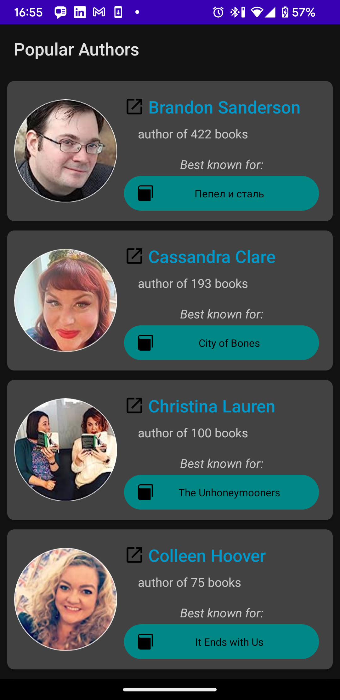
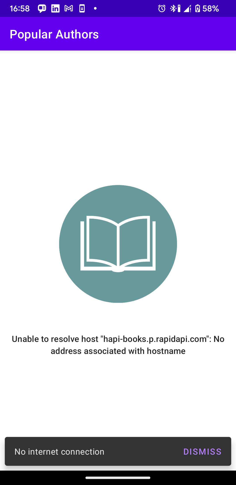
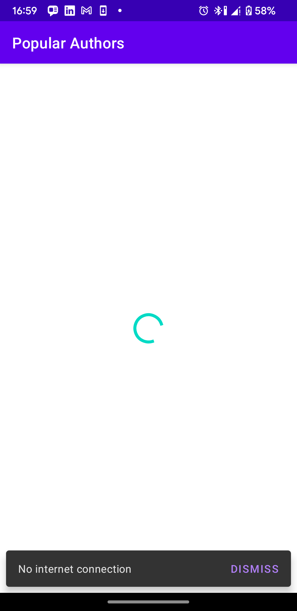
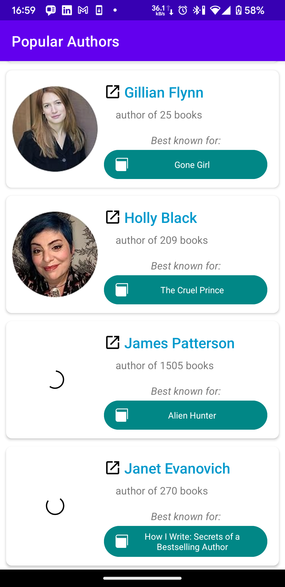
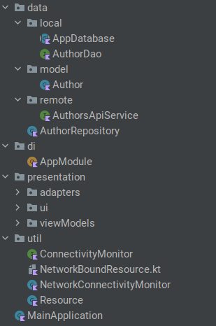

# Popular Authors App

      

## Table of Contents

- [Introduction](#introduction)
- [Features](#features)
- [Architecture and Project Structure](#architecture-and-project-structure)
- [Technologies & Libraries Used](#technologies-and-libraries-used)
- [Challenges Faced](#challenges-faced)
- [Future Improvements](#future-improvements)
- [Getting Started](#getting-started)
    - [Prerequisites](#prerequisites)
    - [Installation](#installation)
- [Usage](#usage)
- [Contributing](#contributing)

## Introduction

Popular Authors App is a Android application showcase written in Kotlin that allows users to discover and explore popular authors and their most known books. It fetches data from a remote API (Rapid API) and caches it locally using Room database for efficient offline access.

## Features

[x] View a list of popular authors with their details (circular picture, name, number of published books and most known book)
[X] Navigate to external web links by clicking author name or book for further details
[X] Offline access to previously fetched data using Room database
[X] Network status monitoring and real-time data handling; Show no connection dismissible snackBar when offline and auto fetch data with connection re-establish.
[X] Swipe/pull to refresh to manually trigger data update
[X] Modularized architecture with MVVM and repository pattern
[X] Image manipulation and caching
[X] Dependency Injection
[ ] Unit testing and functional UI testing

## Architecture and project structure



This project follows the MVVM (Model-View-ViewModel) architecture pattern, which is a popular architectural pattern used in Android development. Here's a description of the key components of the MVVM architecture used in the project:

- **Data Layer:**
  - **Local:** The AppDatabase and AuthorDao handle local storage and database operations for caching authors' data.
  - **Model:** The Model represents the data and business logic of the application. In this project, the Model consists of Author: Represents the data model for an author in the application. It combines the data from both the local database (AuthorEntity) and the remote API (AuthorDTO) into a unified representation.
  - **Remote:** This includes the AuthorsApiService for making network requests to fetch authors' data from the API.
  - **Repository:** The Repository pattern provides a single source of truth for data. In this project, the AuthorRepository serves as a repository for handling data operations. It abstracts the data sources (API and database) from the ViewModel, which only interacts with the repository to fetch and update data. The AuthorRepository uses a network-bound resource pattern to fetch authors' data from the API and cache it in the local database for offline support.
  
- **domain Layer:** (optional) is not used for this simple application
- **DI:** The project uses Hilt, a dependency injection library, to manage and provide dependencies to different components of the application. Hilt provides a cleaner and more modular way to manage dependencies and improves the testability and maintainability of the code.

- **Presentation Layer:**
  - **UIs:** The UI components such as MainActivity, They are responsible for rendering the user interface and interacting with the users.
  - **Adapters:** AuthorsAdapter is responsible for binding author data to the UI components (e.g., RecyclerView items) and displaying them in the UI. The adapter will be used in the MainActivity to populate the list of authors.
  - **ViewModels:** AuthorViewModel as a bridge between the UI and the underlying data layers (repository). ViewModels provide LiveData or Flow objects that the UI observes to display data and react to user interactions.

data flow is managed in a unidirectional manner using Kotlin Flows. Unidirectional data flow is a design pattern where data flows in one direction through the application, from the data source (e.g., remote API, local database) -> repository -> viewModel -> the UI components.

## Technologies and Libraries Used

- Kotlin
- Kotlin coroutines
- Kotlin Flows (instead of LiveData)
- ViewModel
- Room
- RecyclerView
- ViewBinding
- Retrofit for network requests
- Glide for image loading
- Dagger Hilt for dependency injection
- Coroutines for asynchronous programming
- Material Design Components for UI
- SwipeRefreshLayout for pull-to-refresh functionality
- --JUnit and Mockito for unit testing--

## Challenges Faced

During the development of the Popular Authors App, several challenges were encountered and effectively addressed:
- Providing without DI Repository Dependency into ViewModel and ViewModel dependency into MainActivity presented complexity (solution is Hilt)
- Choosing strategy of Room Caching and its Implementation with Kotlin Flows:
- Working with Kotlin Flows instead of LiveData in UI layer

## Future improvements

[ ] (feat) Search and Sort Features
[ ] (UI) Enhanced UI and Reusable UI Elements
[ ] (UI) Logo and Splash Screen
[ ] (UI) Landscape Mode and Tablet Size Support
[ ] (testing) Unit Testing and Functional UI Testing

## Getting Started

### Prerequisites

- Android Studio (latest version)

### Installation

1. Clone the repository:

```bash
git clone https://github.com/Molverin00/popular-authors-app.git
```
2. Open the project in Android Studio.
3. Add **local.properties** file to project root
```groovy
...
rapidapi.key="your_own_api_key"
rapidapi.host="your_own_api_host"
```
4. Build and run the app on an emulator or physical device.

## Usages

Once the app is installed and running, you can view the list of popular authors and their details. Clicking on an author's name or book will take you to the respective external web link for further details.

The app will a snackBar is connection is unavailable

The app provides offline access to previously fetched data using local caching with Room database. It also monitors network status and handles data updates in real-time when the connection is restored.

You can manually trigger data updates by performing a swipe/pull to refresh gesture on the screen.

## Contributing

Contributions are welcome! If you find any bugs or have suggestions for improvements, please open an issue or submit a pull request.
